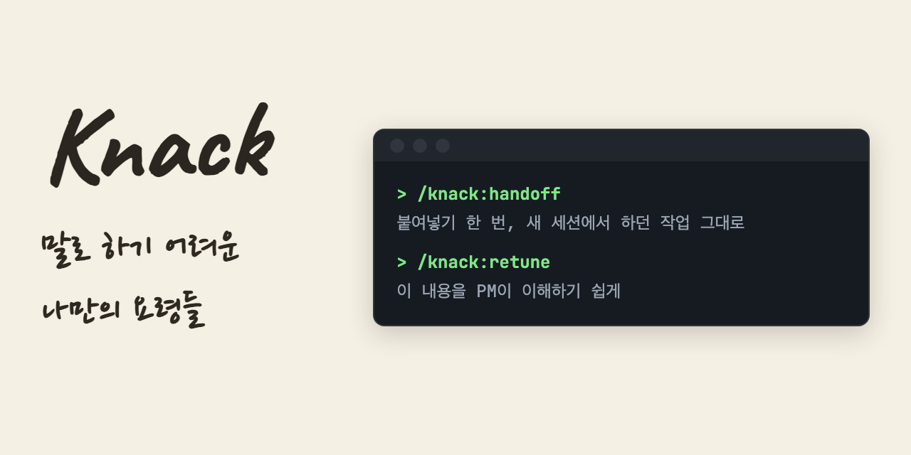

# knack

[English](./README.md) | **한국어**



요령, 손에 익은 재주. 개인용 Claude Code 플러그인 마켓플레이스 —
매일 쓰는 워크플로 습관을 스킬로 만들어 관리·배포한다.

## 설치

Claude Code에서 아래 두 줄을 순서대로 실행:

```
/plugin marketplace add YehyeokBang/knack
/plugin install knack@knack
```

설치 후 스킬은 `/knack:<스킬명>` 형태로 호출한다.

## 업데이트 (auto-update)

서드파티 마켓플레이스는 **auto-update가 기본 OFF**다. 켜두면 push 후
다음 세션에서 자동 반영된다:

```
/plugin  →  marketplace 설정에서 knack의 auto-update 켜기
```

업데이트 감지 트리거는 `plugin.json`의 `version` 값이다 — 버전 범프 없는
push는 설치본에 반영되지 않는다.

## 제공 스킬

> 버전·변경 이력은 [CHANGELOG](./CHANGELOG.md), 현재 버전은 [plugin.json](./plugins/knack/.claude-plugin/plugin.json) 참조.
> 모든 스킬은 단일 플러그인 단위로 함께 배포·업데이트된다.

| 호출 명령 | 설명 | 문서 |
|-----------|------|------|
| `/knack:handoff` | 세션 종료 시 다음 세션용 제로 재설명 handoff prompt 생성 — 경로·커밋 해시 실존 검증 + 코드블록 출력 + 클립보드 복사 | [SKILL.md](./plugins/knack/skills/handoff/SKILL.md) |
| `/knack:retune` | 독자 맞춤 문서 윤문 — 대상 독자(PM/비개발자/타 직군) 눈높이로 재작성. 넘버링·영어 줄임말·번역투·전문용어 교정 | [SKILL.md](./plugins/knack/skills/retune/SKILL.md) |

## 레포 구조

```
knack/
├── .claude-plugin/
│   └── marketplace.json         # 마켓플레이스 카탈로그 (version은 plugin.json과 동기화)
├── plugins/
│   └── knack/                   # 플러그인 (name: "knack")
│       ├── .claude-plugin/
│       │   └── plugin.json      # version — ★ auto-update 트리거
│       ├── skills/
│       │   ├── handoff/         # /knack:handoff
│       │   │   ├── SKILL.md
│       │   │   └── references/  # 인계 유형별 템플릿 3종
│       │   └── retune/          # /knack:retune
│       │       └── SKILL.md
│       └── README.md            # 스킬 인덱스
├── scripts/
│   └── lint-plugin.sh           # 버전 동기화·README 싱크·500줄 검증
├── CHANGELOG.md
├── CLAUDE.md                    # 버전 범프 규칙·롤백 절차·브랜치 정책
├── README.md                    # 영문 (메인)
└── README.ko.md                 # 한글 (이 파일)
```

> 새 스킬은 `skills/` 아래 디렉토리만 추가하면 `/knack:<디렉토리명>`으로 자동 등록된다.

## 요구사항

- macOS (`/knack:handoff`의 클립보드 복사가 `pbcopy` 의존 — 크로스플랫폼 지원은 로드맵)

## 문의

- 버그·개선 요청: [knack Issues](https://github.com/YehyeokBang/knack/issues)
